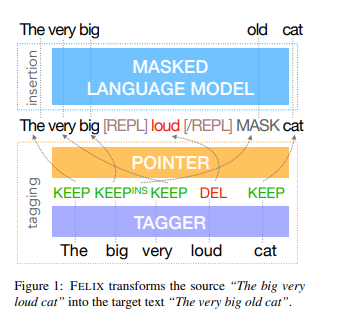

# felix-chinese
基于bert4keras实现的flexible text edit model，在中文CSL标签生成数据集上的应用

### Paper
[Felix: Flexible Text Editing Through Tagging and Insertion](https://arxiv.org/pdf/2003.10687.pdf)  

### 数据集
使用数据集为完整版数据集csl_10k，可以加入群808623966，在群文件中获取，部分数据集可在[CSL数据集](https://github.com/CLUEbenchmark/CLGE#1-csl-%E4%B8%AD%E9%95%BF%E6%96%87%E6%9C%AC%E6%91%98%E8%A6%81%E7%94%9F%E6%88%90) 获取

### 预训练模型
预训练模型为[GAU-alpha](https://github.com/ZhuiyiTechnology/GAU-alpha)

### 环境
bert4keras==0.11.3  
tensorflow-gpu==2.3.1  
windows  
GPU为1060 6G

### 执行步骤
1. 首先在`data/csl_10k/`文件夹中放入数据，并运行`data_loader.py`,此操作将会按照9:1的比例将`data/csl_10k/train.tsv`分成训练集和验证集，并在`data/csl_10k`中生成`train.tfrecord, train_insert.tfrecord, dev.tfrecord, dev_insert.tfrecord`4个文件，文件不大，可以放心生成  
2. 运行`felix_tag_model.py`，生成tagging model，模型按照rouge-main指标保存最优模型
3. 运行`felix_insert_model.py`，生成insert model，同样按照rouge-main指标保存最优模型

### 结果
在验证集上的结果如下，运行时间挺长的，模型跑一轮耗时900-1000s,单句的预测效率约为12/s
***
{'main': 0.5598330587426612, 'rouge-1': 0.6812786409561323, 'rouge-2': 0.4960481570547531, 'rouge-l': 0.5628951693238344, 'bleu': 0.36377347414832245}
***

### 模型框架
felix主体框架为tagging， point network 以及 mlm predict。tagging模型为简单的分类模型，简单的通过BERT+DENSE结构为每一个字分配一个DELETE,KEEP或KEEP|INSERT_NUM的标签，其中INSERT_NUM代表需要插入的字数。 
point network用于调换字的顺序，其为当前字预测下一个字所在位置，point network为简单的attention结构，即Q*K.T 
mlm predict又叫insert，在预测阶段，KEEP|INSERT_NUM的标签会解码为`[MASK] [MASK] ... word`的形式，即保留word并在前面插入INSERT_NUM个mask，并通过mlm的形式进行预测 

### 结论
felix相比之前实现的[lasertagger](https://github.com/hanggun/lasertagger-chinese) 能够覆盖99%的数据集，并不像lasertagger只能覆盖50%左右的数据集，其不受词表限制，词表为BERT自带的词表，理论上拥有较高的泛化性，只要训练数据足够，但是从目前复现的结果来看，仍然存在预测语句不通顺的情况。  
欢迎一起探讨问题